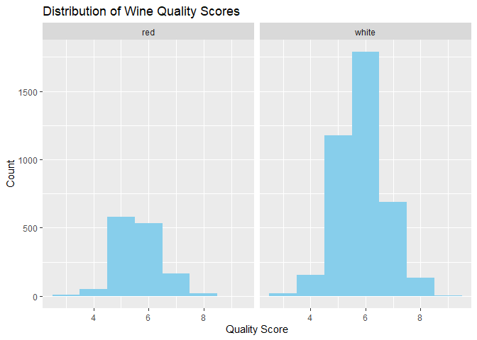
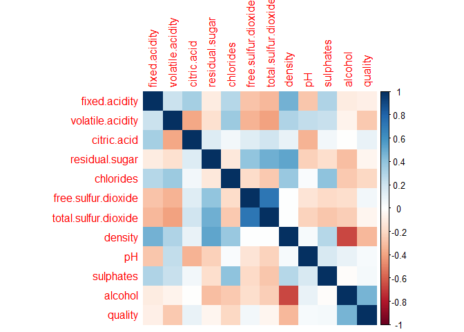
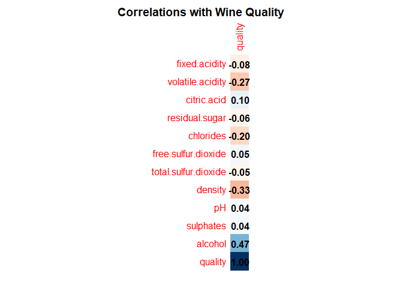
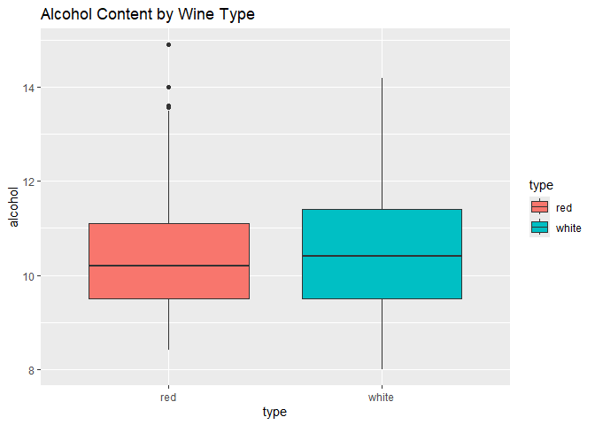
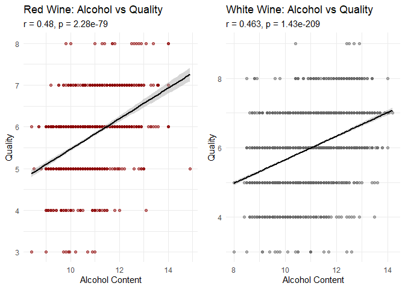
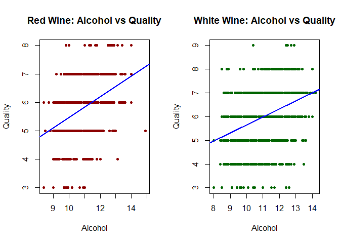
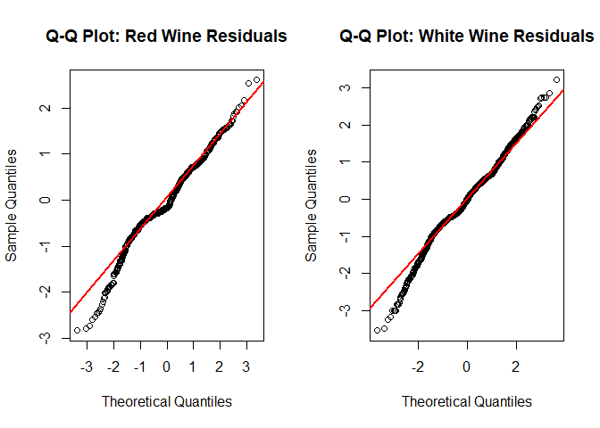
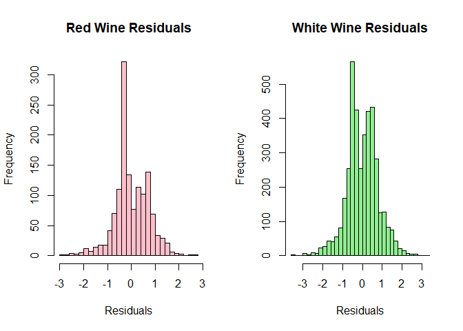
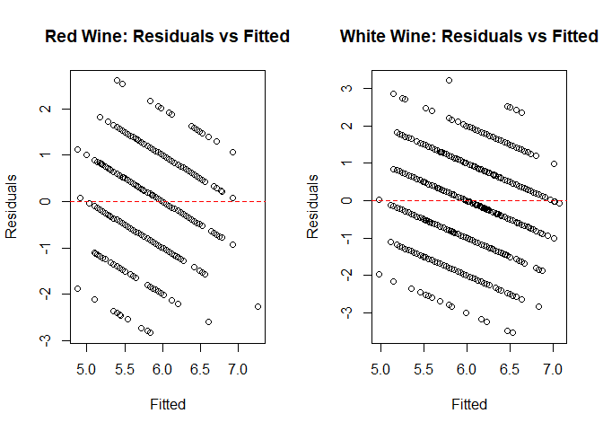

README
================

## Introduction

Hello! My name is Yoryi Roque, and I will be performing data analytics to conclude a hypothesis of whether or not the percentage of alcohol directly affects the quality of a wine. I will be using 2 datasets, both with equal column names and characteristics, but for its respective wine type.

``` r
#Install packages

# Please install required packages before knitting:
# install.packages(c("ggplot2", "dplyr", "corrplot, lmtest"))

#Install Libraries
library(tidyverse)
```

    ## Warning: package 'tidyverse' was built under R version 4.4.3

    ## Warning: package 'ggplot2' was built under R version 4.4.3

    ## Warning: package 'tidyr' was built under R version 4.4.3

    ## Warning: package 'readr' was built under R version 4.4.3

    ## Warning: package 'purrr' was built under R version 4.4.3

    ## Warning: package 'forcats' was built under R version 4.4.3

    ## Warning: package 'lubridate' was built under R version 4.4.3

    ## ── Attaching core tidyverse packages ──────────────────────── tidyverse 2.0.0 ──
    ## ✔ dplyr     1.1.4     ✔ readr     2.1.5
    ## ✔ forcats   1.0.0     ✔ stringr   1.5.1
    ## ✔ ggplot2   3.5.2     ✔ tibble    3.2.1
    ## ✔ lubridate 1.9.4     ✔ tidyr     1.3.1
    ## ✔ purrr     1.0.4     
    ## ── Conflicts ────────────────────────────────────────── tidyverse_conflicts() ──
    ## ✖ dplyr::filter() masks stats::filter()
    ## ✖ dplyr::lag()    masks stats::lag()
    ## ℹ Use the conflicted package (<http://conflicted.r-lib.org/>) to force all conflicts to become errors

``` r
library(ggpubr)
```

    ## Warning: package 'ggpubr' was built under R version 4.4.3

``` r
library(ggplot2)
library(lmtest)
```

    ## Warning: package 'lmtest' was built under R version 4.4.3

    ## Loading required package: zoo
    ## 
    ## Attaching package: 'zoo'
    ## 
    ## The following objects are masked from 'package:base':
    ## 
    ##     as.Date, as.Date.numeric

``` r
library(GGally)  # For pair plots
```

    ## Warning: package 'GGally' was built under R version 4.4.3

    ## Registered S3 method overwritten by 'GGally':
    ##   method from   
    ##   +.gg   ggplot2

``` r
library(corrplot) # For correlation matrices
```

    ## Warning: package 'corrplot' was built under R version 4.4.3

    ## corrplot 0.95 loaded

``` r
# Load red wine data
redWineData = read.csv("https://archive.ics.uci.edu/ml/machine-learning-databases/wine-quality/winequality-red.csv", sep = ";")

# Load white wine data
whiteWineData = read.csv("https://archive.ics.uci.edu/ml/machine-learning-databases/wine-quality/winequality-white.csv", sep = ";")

colnames(redWineData)
```

    ##  [1] "fixed.acidity"        "volatile.acidity"     "citric.acid"         
    ##  [4] "residual.sugar"       "chlorides"            "free.sulfur.dioxide" 
    ##  [7] "total.sulfur.dioxide" "density"              "pH"                  
    ## [10] "sulphates"            "alcohol"              "quality"

``` r
colnames(whiteWineData)
```

    ##  [1] "fixed.acidity"        "volatile.acidity"     "citric.acid"         
    ##  [4] "residual.sugar"       "chlorides"            "free.sulfur.dioxide" 
    ##  [7] "total.sulfur.dioxide" "density"              "pH"                  
    ## [10] "sulphates"            "alcohol"              "quality"

## Knowledge of the potential units

For the usage of good red wine and white wine, there are important factors that make wine rich with quality,  
but some of the most important values are as follows:  
1. Alcohol: the higher quality the alcohol is, the better the quality is.  
(12.5-15% for red and 10-13% for white)  
2. Volative Acidity: Lower values work, but the higher the acidity, the more the wine tastes like vinegar  
(\<0.6 g/L for red, \<0.4 g/L for white)  
3. Sulphates: Medium to high sulfates preserves the wine and improves its stability  
(0.5-0.8 g/L for red, 0.4-0.7 g/L for white)  
4. Citric Acid: Makes it fresh, so it should aim around a medium value  
(0.1-0.5 g/L for red, 0.2-0.6 g/L for white)  
5. Residual Sugar: Should be balanced, since too little can make wine harsh, while too much can cloy the wine  
(\< 4 g/L = dry and \> 35 g/L = sweet for red, \< 3 g/L = dry and \> 30 g/L = sweet for white)  
6. pH / total Acidity: A good range of 3-4 pH is good for wine  
(3.3-3.6 for red, 3.0-3.4 for white FOR pH)(6-10 g/L for red, 5-9 g/L for white FOR TOTAL acidity)  
7. Sulfur Dioxide (Free and total): The right level prevents oxidation but too much causes off-flavors  
(20-50 mg/L for red, 30-60 mg/L for white FOR FSulfur)(\<150 mg/L for red, \<200 mg/L for white FOR TSulfur)  
8. Chlorides: Higher causes saltiness, lower usually means a better quality wine  
(\<0.1 g/L for red, \<0.08 g/L for white)

Therefore, for good value wine, it’s ideal to use the ranges as presented earlier, compare it to the ones presented in both the red and white wine, and see if it falls under the right category according to the quality index from professionals as well.

## Red Wine Evaluation

``` r
#Red wine evaluation

# Number of samples (rows)
num_samples_Red = nrow(redWineData)

# Number of features (columns)
num_features_Red = ncol(redWineData)

# Feature names
feature_names_Red = colnames(redWineData)

# Data types
feature_types_Red = sapply(redWineData, class)

# Summary
cat("Number of samples:", num_samples_Red, "\n")
```

    ## Number of samples: 1599

``` r
cat("Number of features:", num_features_Red, "\n\n")
```

    ## Number of features: 12

``` r
cat("Feature names and types:\n")
```

    ## Feature names and types:

``` r
print(data.frame(Feature_Red = feature_names_Red, Type = feature_types_Red))
```

    ##                               Feature_Red    Type
    ## fixed.acidity               fixed.acidity numeric
    ## volatile.acidity         volatile.acidity numeric
    ## citric.acid                   citric.acid numeric
    ## residual.sugar             residual.sugar numeric
    ## chlorides                       chlorides numeric
    ## free.sulfur.dioxide   free.sulfur.dioxide numeric
    ## total.sulfur.dioxide total.sulfur.dioxide numeric
    ## density                           density numeric
    ## pH                                     pH numeric
    ## sulphates                       sulphates numeric
    ## alcohol                           alcohol numeric
    ## quality                           quality integer

``` r
# Create a new data frame with measurement levels
measurement_levels_Red <- c(
  "fixed.acidity" = "Ratio",
  "volatile.acidity" = "Ratio",
  "citric.acid" = "Ratio",
  "residual.sugar" = "Ratio",
  "chlorides" = "Ratio",
  "free.sulfur.dioxide" = "Ratio",
  "total.sulfur.dioxide" = "Ratio",
  "density" = "Ratio",
  "pH" = "Interval",
  "sulphates" = "Ratio",
  "alcohol" = "Ratio",
  "quality" = "Ordinal"  # since it's a score (0–10 scale)
)

# Combine with feature info
info_df_Red = data.frame(
  Feature_Red = names(measurement_levels_Red),
  Type_Red = sapply(redWineData, class),
  Measurement_Red = measurement_levels_Red
)
```

Since both the red and white csv files have identical column names, I found it easier to just use the information for one of the files since it determines the other in the same way. All but the pH and quality measurements are ratios and pure numbers because they fit all the criteria of a ratio numeral. pH, while it is a number, does not have a true 0, nor can it be multiplied across with other values.

## Preview analytics (cleaning up data, glimpse, combining the data)

``` r
print(info_df_Red)
```

    ##                               Feature_Red Type_Red Measurement_Red
    ## fixed.acidity               fixed.acidity  numeric           Ratio
    ## volatile.acidity         volatile.acidity  numeric           Ratio
    ## citric.acid                   citric.acid  numeric           Ratio
    ## residual.sugar             residual.sugar  numeric           Ratio
    ## chlorides                       chlorides  numeric           Ratio
    ## free.sulfur.dioxide   free.sulfur.dioxide  numeric           Ratio
    ## total.sulfur.dioxide total.sulfur.dioxide  numeric           Ratio
    ## density                           density  numeric           Ratio
    ## pH                                     pH  numeric        Interval
    ## sulphates                       sulphates  numeric           Ratio
    ## alcohol                           alcohol  numeric           Ratio
    ## quality                           quality  integer         Ordinal

``` r
#Cleaning up the data

# Check for missing values
colSums(is.na(redWineData))
```

    ##        fixed.acidity     volatile.acidity          citric.acid 
    ##                    0                    0                    0 
    ##       residual.sugar            chlorides  free.sulfur.dioxide 
    ##                    0                    0                    0 
    ## total.sulfur.dioxide              density                   pH 
    ##                    0                    0                    0 
    ##            sulphates              alcohol              quality 
    ##                    0                    0                    0

``` r
colSums(is.na(whiteWineData))
```

    ##        fixed.acidity     volatile.acidity          citric.acid 
    ##                    0                    0                    0 
    ##       residual.sugar            chlorides  free.sulfur.dioxide 
    ##                    0                    0                    0 
    ## total.sulfur.dioxide              density                   pH 
    ##                    0                    0                    0 
    ##            sulphates              alcohol              quality 
    ##                    0                    0                    0

``` r
glimpse(redWineData)
```

    ## Rows: 1,599
    ## Columns: 12
    ## $ fixed.acidity        <dbl> 7.4, 7.8, 7.8, 11.2, 7.4, 7.4, 7.9, 7.3, 7.8, 7.5…
    ## $ volatile.acidity     <dbl> 0.700, 0.880, 0.760, 0.280, 0.700, 0.660, 0.600, …
    ## $ citric.acid          <dbl> 0.00, 0.00, 0.04, 0.56, 0.00, 0.00, 0.06, 0.00, 0…
    ## $ residual.sugar       <dbl> 1.9, 2.6, 2.3, 1.9, 1.9, 1.8, 1.6, 1.2, 2.0, 6.1,…
    ## $ chlorides            <dbl> 0.076, 0.098, 0.092, 0.075, 0.076, 0.075, 0.069, …
    ## $ free.sulfur.dioxide  <dbl> 11, 25, 15, 17, 11, 13, 15, 15, 9, 17, 15, 17, 16…
    ## $ total.sulfur.dioxide <dbl> 34, 67, 54, 60, 34, 40, 59, 21, 18, 102, 65, 102,…
    ## $ density              <dbl> 0.9978, 0.9968, 0.9970, 0.9980, 0.9978, 0.9978, 0…
    ## $ pH                   <dbl> 3.51, 3.20, 3.26, 3.16, 3.51, 3.51, 3.30, 3.39, 3…
    ## $ sulphates            <dbl> 0.56, 0.68, 0.65, 0.58, 0.56, 0.56, 0.46, 0.47, 0…
    ## $ alcohol              <dbl> 9.4, 9.8, 9.8, 9.8, 9.4, 9.4, 9.4, 10.0, 9.5, 10.…
    ## $ quality              <int> 5, 5, 5, 6, 5, 5, 5, 7, 7, 5, 5, 5, 5, 5, 5, 5, 7…

``` r
glimpse(whiteWineData)
```

    ## Rows: 4,898
    ## Columns: 12
    ## $ fixed.acidity        <dbl> 7.0, 6.3, 8.1, 7.2, 7.2, 8.1, 6.2, 7.0, 6.3, 8.1,…
    ## $ volatile.acidity     <dbl> 0.27, 0.30, 0.28, 0.23, 0.23, 0.28, 0.32, 0.27, 0…
    ## $ citric.acid          <dbl> 0.36, 0.34, 0.40, 0.32, 0.32, 0.40, 0.16, 0.36, 0…
    ## $ residual.sugar       <dbl> 20.70, 1.60, 6.90, 8.50, 8.50, 6.90, 7.00, 20.70,…
    ## $ chlorides            <dbl> 0.045, 0.049, 0.050, 0.058, 0.058, 0.050, 0.045, …
    ## $ free.sulfur.dioxide  <dbl> 45, 14, 30, 47, 47, 30, 30, 45, 14, 28, 11, 17, 1…
    ## $ total.sulfur.dioxide <dbl> 170, 132, 97, 186, 186, 97, 136, 170, 132, 129, 6…
    ## $ density              <dbl> 1.0010, 0.9940, 0.9951, 0.9956, 0.9956, 0.9951, 0…
    ## $ pH                   <dbl> 3.00, 3.30, 3.26, 3.19, 3.19, 3.26, 3.18, 3.00, 3…
    ## $ sulphates            <dbl> 0.45, 0.49, 0.44, 0.40, 0.40, 0.44, 0.47, 0.45, 0…
    ## $ alcohol              <dbl> 8.8, 9.5, 10.1, 9.9, 9.9, 10.1, 9.6, 8.8, 9.5, 11…
    ## $ quality              <int> 6, 6, 6, 6, 6, 6, 6, 6, 6, 6, 5, 5, 5, 7, 5, 7, 6…

``` r
# Check for duplicates
cat("Red wine duplicates:", sum(duplicated(redWineData)), "\n")
```

    ## Red wine duplicates: 240

``` r
cat("White wine duplicates:", sum(duplicated(whiteWineData)), "\n")
```

    ## White wine duplicates: 937

``` r
#Removing dulplicates
redWineData = redWineData[!duplicated(redWineData), ]  # Keeps only unique rows
whiteWineData = whiteWineData[!duplicated(whiteWineData), ]

# Add 'type' column
redWineData$type = "red"
whiteWineData$type = "white"

# Combine datasets (like pd.concat)
winesData = rbind(redWineData, whiteWineData)
```

In this step, I cleaned up the data by checking if any data was missing/ null within the data, which was not true. Because of that, I moved onto the next step which was to remove any data that was duplicated within the data, which was a lot more than I expected with numbers of 240 duplicated in the red wine and 937 in the white wine. I removed them to not have excessive data. Finally, I decided to make a dataset with the 2 values combined for comparisons to be done together.

## Visualizations of the data to quality grading

    ## Rows: 5,320
    ## Columns: 13
    ## $ fixed.acidity        <dbl> 7.4, 7.8, 7.8, 11.2, 7.4, 7.9, 7.3, 7.8, 7.5, 6.7…
    ## $ volatile.acidity     <dbl> 0.700, 0.880, 0.760, 0.280, 0.660, 0.600, 0.650, …
    ## $ citric.acid          <dbl> 0.00, 0.00, 0.04, 0.56, 0.00, 0.06, 0.00, 0.02, 0…
    ## $ residual.sugar       <dbl> 1.9, 2.6, 2.3, 1.9, 1.8, 1.6, 1.2, 2.0, 6.1, 1.8,…
    ## $ chlorides            <dbl> 0.076, 0.098, 0.092, 0.075, 0.075, 0.069, 0.065, …
    ## $ free.sulfur.dioxide  <dbl> 11, 25, 15, 17, 13, 15, 15, 9, 17, 15, 16, 9, 52,…
    ## $ total.sulfur.dioxide <dbl> 34, 67, 54, 60, 40, 59, 21, 18, 102, 65, 59, 29, …
    ## $ density              <dbl> 0.9978, 0.9968, 0.9970, 0.9980, 0.9978, 0.9964, 0…
    ## $ pH                   <dbl> 3.51, 3.20, 3.26, 3.16, 3.51, 3.30, 3.39, 3.36, 3…
    ## $ sulphates            <dbl> 0.56, 0.68, 0.65, 0.58, 0.56, 0.46, 0.47, 0.57, 0…
    ## $ alcohol              <dbl> 9.4, 9.8, 9.8, 9.8, 9.4, 9.4, 10.0, 9.5, 10.5, 9.…
    ## $ quality              <int> 5, 5, 5, 6, 5, 5, 7, 7, 5, 5, 5, 5, 5, 5, 7, 5, 4…
    ## $ type                 <chr> "red", "red", "red", "red", "red", "red", "red", …

    ##  fixed.acidity    volatile.acidity  citric.acid     residual.sugar  
    ##  Min.   : 3.800   Min.   :0.0800   Min.   :0.0000   Min.   : 0.600  
    ##  1st Qu.: 6.400   1st Qu.:0.2300   1st Qu.:0.2400   1st Qu.: 1.800  
    ##  Median : 7.000   Median :0.3000   Median :0.3100   Median : 2.700  
    ##  Mean   : 7.215   Mean   :0.3441   Mean   :0.3185   Mean   : 5.048  
    ##  3rd Qu.: 7.700   3rd Qu.:0.4100   3rd Qu.:0.4000   3rd Qu.: 7.500  
    ##  Max.   :15.900   Max.   :1.5800   Max.   :1.6600   Max.   :65.800  
    ##    chlorides       free.sulfur.dioxide total.sulfur.dioxide    density      
    ##  Min.   :0.00900   Min.   :  1.00      Min.   :  6.0        Min.   :0.9871  
    ##  1st Qu.:0.03800   1st Qu.: 16.00      1st Qu.: 74.0        1st Qu.:0.9922  
    ##  Median :0.04700   Median : 28.00      Median :116.0        Median :0.9947  
    ##  Mean   :0.05669   Mean   : 30.04      Mean   :114.1        Mean   :0.9945  
    ##  3rd Qu.:0.06600   3rd Qu.: 41.00      3rd Qu.:153.2        3rd Qu.:0.9968  
    ##  Max.   :0.61100   Max.   :289.00      Max.   :440.0        Max.   :1.0390  
    ##        pH          sulphates         alcohol         quality     
    ##  Min.   :2.720   Min.   :0.2200   Min.   : 8.00   Min.   :3.000  
    ##  1st Qu.:3.110   1st Qu.:0.4300   1st Qu.: 9.50   1st Qu.:5.000  
    ##  Median :3.210   Median :0.5100   Median :10.40   Median :6.000  
    ##  Mean   :3.225   Mean   :0.5334   Mean   :10.55   Mean   :5.796  
    ##  3rd Qu.:3.330   3rd Qu.:0.6000   3rd Qu.:11.40   3rd Qu.:6.000  
    ##  Max.   :4.010   Max.   :2.0000   Max.   :14.90   Max.   :9.000  
    ##      type          
    ##  Length:5320       
    ##  Class :character  
    ##  Mode  :character  
    ##                    
    ##                    
    ## 



This graph shows the number of quality scores there are compared to both the red and white wine datasets. This is after the code has been cleaned and duplicates have been removed. However, there is still a huge gap between the quantity of red and white wine, which may affect how certain relationships are formed.



To help with my research of exactly what factors make a good quality wine, this chart of the Pearsons Coefficients shows the negative and positive relationships with every possible value. What i wanted to measure is the relationship between the Alcohol content and the quality of the wines according to the critic grading, and see how positive/negative the relationship is.



This chart gives more accurate numbers of the Pearsons coefficient, where we can see generally alcohol has a medium positive relationship with how good the quality of the wine is, and is the value with the strongest absolute value relation value (by that, alcohols 0.47 is the strongest correlation of either positive or negative of all the values)



This box plot shows the amount of values that are located within the 2nd and 3rd Quadrant of the data, along with a few outliars as seen with the red wine data. This helps with showing the average amount of alcohol content is in each wine.

## Hypothesis testing

For my hypothesis, as mentioned earlier, I want to showcase the correlation between alcohol and how a greater alcohol content concludes with better quality wine according to critical ratings. The null hypothesis would be there is zero correlation between the percentage of alcohol, positive or negative, with the quality of the wine while the alternative will be that there is a correlation between the alcohol and wine quality.

    ## Red Wine - Pearson r: 0.4803429 | p-value: 2.278721e-79

    ## White Wine - Pearson r: 0.4628693 | p-value: 1.428531e-209



These 2 plots, side by side, shows the positive correlation between the 2 graphs with it’s r statistic graph, regression line and points at each of the qualities in comparison to that wines alcohol percentage. As seen by the line of best fit, the higher the percentage of alcohol, the better quality the alcohol is. Both red and white wine statistics share extremely low p-values, which rejects the null hypothesis of there being zero correlation between alcohol percentage and wine quality. The p-value for the white wine is significantly smaller because there is more values to make the statistic smaller. Therefore, it helps prove my hypothesis of alcohol’s importance in wine.

## Assumption checks of the data

    ## 
    ## Call:
    ## lm(formula = quality ~ alcohol, data = redWineData)
    ## 
    ## Residuals:
    ##     Min      1Q  Median      3Q     Max 
    ## -2.8308 -0.3921 -0.1727  0.5348  2.6079 
    ## 
    ## Coefficients:
    ##             Estimate Std. Error t value Pr(>|t|)    
    ## (Intercept)  1.80923    0.19007   9.519   <2e-16 ***
    ## alcohol      0.36560    0.01812  20.174   <2e-16 ***
    ## ---
    ## Signif. codes:  0 '***' 0.001 '**' 0.01 '*' 0.05 '.' 0.1 ' ' 1
    ## 
    ## Residual standard error: 0.7226 on 1357 degrees of freedom
    ## Multiple R-squared:  0.2307, Adjusted R-squared:  0.2302 
    ## F-statistic:   407 on 1 and 1357 DF,  p-value: < 2.2e-16

    ## 
    ## Call:
    ## lm(formula = quality ~ alcohol, data = whiteWineData)
    ## 
    ## Residuals:
    ##     Min      1Q  Median      3Q     Max 
    ## -3.5359 -0.4858  0.0061  0.5142  3.2093 
    ## 
    ## Coefficients:
    ##             Estimate Std. Error t value Pr(>|t|)    
    ## (Intercept)  2.26782    0.10989   20.64   <2e-16 ***
    ## alcohol      0.33874    0.01031   32.86   <2e-16 ***
    ## ---
    ## Signif. codes:  0 '***' 0.001 '**' 0.01 '*' 0.05 '.' 0.1 ' ' 1
    ## 
    ## Residual standard error: 0.7896 on 3959 degrees of freedom
    ## Multiple R-squared:  0.2142, Adjusted R-squared:  0.214 
    ## F-statistic:  1079 on 1 and 3959 DF,  p-value: < 2.2e-16

Now, to prove that the Pearsons Coefficient does signify some relationship, I need to run a linear model of the alcohol and quality data through a series of tests such as the linear regression test, multiple types of residual tests, and a unique Homoscedasticity test to prove its relation.



The first test of linear regression modeling proves a linear relationship between the alcohol content and grading of quality of the wine. If the points were scattered more in a curve, we could disprove a straight correlation between the values and the Pearsons coefficient. This is not the cae because the model also displays a linear line with no need of multiple degrees of the evaluation to curve it.

### Q-Q plots



Q-Q plots, or quantile to quantile plots, visually measures if the residuals of the alcohol & quality dataset line up with a normal distribution. Residuals themselves is the difference/error between the predicted value a data point based on the linear regression model vs where the actual point lies on the graph. Therefore, if more of the points line up with the normal distribution line, then the values can help clarify that the dataset is normally distributed. According to the line, it appears that most of the value are normally distributed, especially the bigger the percentage of alcohol becomes. Between the red and white wine, the white wine has values more normalized than the red wine because it’s points stray towards -2, not -3 as seen with the red wine, which strays away from a normal distribution argument.

### Histogram of residuals



Viewing the histogram of the residuals give us an additional insight of how the data is oriented. As seen in both of the histograms, but more prominently in the red wine dataset, the majority of the information is between -1 and 1 residuals from their actual data point. However, the red wine dataset had a big amount of its data around -0.7 of a residual off from its original value. This may explain why, according to the Q-Q plot, the normal distribution of the red wine was wider than that of the white wine. Either way, since there is not a major quantity of skewing of the points, I can visually conclude that the residuals are not entirely far off from the line on the linear regression.

### Homoscedasticity check (residuals vs fitted)



The homoscedasticity test/check presents a graph which should have the x line as the fitted values, or the values predicted by the linear model, and the y axis as the residuals of the red and white wine. The reason the points are jumpy is because of the quality values, which are ordinal and have no values in between. Based on the visualization, most of the data falls in between -1 and 1 residuals as compared to the fitted values. It aligns with the information presented with the residuals on the histogram, where a majority of the data points are not directly at zero, but relatively close to the sides of it. This means the residuals aren’t far off the points which help support there is a correlation between the points, and that relationship is positive.

## Conclusion

Based on the pearsons Coefficient Test, along with the assumption checks and tests to prove the correlations between the information, I can safety conclude based on the assumptions that there is a positive relationship with the percentage of Alcohol within both red and white wine and how good the quality of the wine is.
